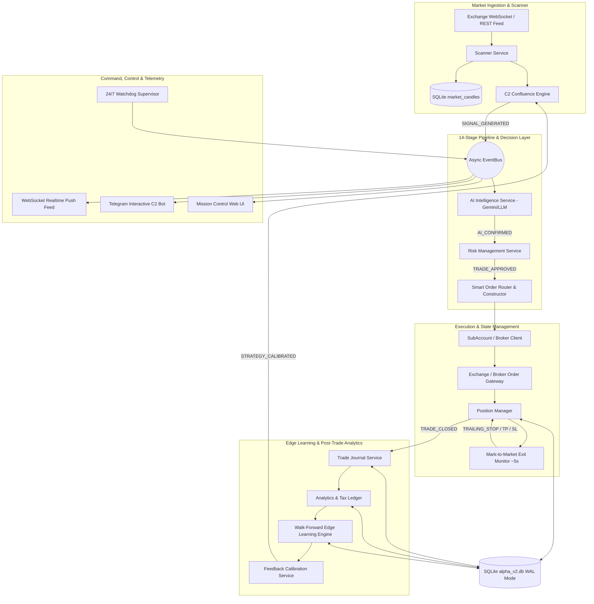
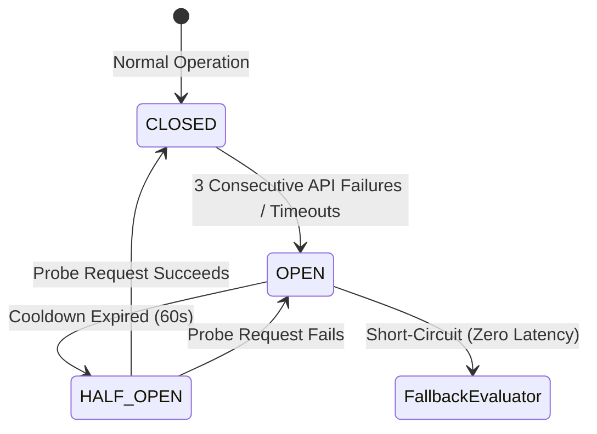

# PROJECT-ALPHA V2: Master Engineering Blueprint & Stock Market Clone Guide

> **Document Type:** Master Technical Specification & Architecture Blueprint  
> **Target Audience:** Systems Architects, Quantitative Developers, Algorithmic Traders  
> **Source Platform:** PROJECT-ALPHA V2 (Institutional Event-Driven Crypto Quantitative Trading Engine)  
> **Target Application:** Complete Clone & Adaptation for Equities / Stock Markets (NSE, BSE, NYSE, NASDAQ)  
> **Release Version:** `v2.0.0-production`

---

## Table of Contents

1. [Executive Summary & High-Level Architecture](#1-executive-summary--high-level-architecture)
2. [The 14-Stage Execution & Intelligence Lifecycle](#2-the-14-stage-execution--intelligence-lifecycle)
3. [Event-Driven Core & EventBus Specification](#3-event-driven-core--eventbus-specification)
4. [Complete Microservices Catalog (15 Subsystems)](#4-complete-microservices-catalog-15-subsystems)
5. [Database Architecture & Complete SQLite Schema (21 Tables)](#5-database-architecture--complete-sqlite-schema-21-tables)
6. [Quantitative Strategy Engine & The 4 Bot Archetypes](#6-quantitative-strategy-engine--the-4-bot-archetypes)
7. [C2 Confluence Scoring Engine](#7-c2-confluence-scoring-engine)
8. [AI Thesis Validator & Circuit Breaker Subsystem](#8-ai-thesis-validator--circuit-breaker-subsystem)
9. [RMS, Capital Guard & Single-Asset Invariant](#9-rms-capital-guard--single-asset-invariant)
10. [Execution Engine, Smart Router & Order Reconciliation](#10-execution-engine-smart-router--order-reconciliation)
11. [Post-Trade Intelligence, Edge Learning & Self-Healing Feedback Loop](#11-post-trade-intelligence-edge-learning--self-healing-feedback-loop)
12. [Operations, Monitoring, Telegram C2 & Web Dashboard](#12-operations-monitoring-telegram-c2--web-dashboard)
13. [Step-by-Step Stock Market Clone Guide (Equities Adaptation)](#13-step-by-step-stock-market-clone-guide-equities-adaptation)
14. [File-by-File Code Transformation Matrix](#14-file-by-file-code-transformation-matrix)
15. [Production Deployment & Verification Runbook](#15-production-deployment--verification-runbook)

---

## 1. Executive Summary & High-Level Architecture

PROJECT-ALPHA V2 is an institutional-grade, asynchronous, event-driven quantitative algorithmic trading platform. It eliminates tight coupling by replacing monolithic loops with an asynchronous in-process **EventBus**, clean **Repository Pattern** persistence on SQLite WAL, an autonomous **14-Stage Execution & Intelligence Pipeline**, **AI Thesis Validation** with hardware circuit breakers, and an automated **Self-Calibrating Feedback Loop**.

### System Topology Diagram



---

## 2. The 14-Stage Execution & Intelligence Lifecycle

Every trading opportunity must pass sequentially through 14 deterministic stages before execution, followed by post-trade analysis and mathematical parameter optimization:

| Stage # | Stage Name | Component / Engine | Responsibility & Invariants |
| :--- | :--- | :--- | :--- |
| **1** | **Market Data Ingestion** | `ScannerService` | Fetches multi-timeframe candles (15m, 1h, 1d) and orderbook tickers. |
| **2** | **Multi-Timeframe Scanner** | `ScannerService` | Filters coins/stocks meeting base volume, liquidity, and trend alignment. |
| **3** | **C2 Confluence Scorecard** | `ConfluenceEngine` | Computes weighted score across 4 pillars (Chart, Indicators, Regime, Sentiment). Must score $\ge 85.0$ for ELITE pass. |
| **4** | **AI Thesis Validator** | `AIIntelligenceService` | LLM validates trade hypothesis, momentum sustainability, and structural catalysts. |
| **5** | **Trade Constructor** | `SubAccountManager` | Computes precision-rounded quantity, entry notional, SL/TP prices, and trailing step. |
| **6** | **RMS Capital Guard** | `RiskService` | Enforces Single-Asset Lock (1 active trade per coin/stock across entire fleet), daily loss limits, and pool allocation. |
| **7** | **Smart Router** | `TradingService` | Selects optimal subaccount, constructs authenticated payloads, and dispatches orders. |
| **8** | **Position Manager** | `PositionManager` | Tracks live position lifecycle, entry execution, software brackets, and status transitions. |
| **9** | **Mark-to-Market Engine** | `exit_monitor (Scheduler)` | Polls fresh ticker prices every 5s, computes unrealized P&L, advances trailing stops, and triggers exits. |
| **10** | **Friction & Tax Ledger** | `AnalyticsService` | Deducts statutory slippage, brokerage, exchange fees, and tax liability (TDS / STT). |
| **11** | **Attribution Journal** | `JournalService` | Persists immutable entry/exit rationale, snapshot metrics, and divergence reasons. |
| **12** | **Edge Analytics** | `AnalyticsService` | Evaluates win rate, profit factor, Sharpe ratio, and archetype performance. |
| **13** | **Walk-Forward Optimizer** | `LearningService` | Evaluates out-of-sample data against parameter matrices to detect alpha decay. |
| **14** | **Strategy Calibration** | `FeedbackService` | Automatically tunes confluence weights and risk multipliers to adapt to shifting market regimes. |

---

## 3. Event-Driven Core & EventBus Specification

The system uses an asynchronous publish-subscribe pattern with strong typing (`v2/bus/event_types.py`).

### Event Catalog

```python
class EventType(str, Enum):
    # Scanner & Signals
    SCANNER_TICK          = "scanner.tick"
    SIGNAL_GENERATED      = "signal.generated"
    SIGNAL_FILTERED       = "signal.filtered"
    SIGNAL_EXPIRED        = "signal.expired"

    # AI Intelligence & Circuit Breaker
    AI_EVALUATION_STARTED = "ai.evaluation_started"
    AI_CONFIRMED          = "ai.confirmed"
    AI_REJECTED           = "ai.rejected"
    AI_CIRCUIT_OPENED     = "ai.circuit_opened"
    AI_CIRCUIT_CLOSED     = "ai.circuit_closed"

    # Risk & Capital Guard
    RISK_CHECK_PASSED     = "risk.check_passed"
    RISK_CHECK_FAILED     = "risk.check_failed"
    CIRCUIT_BREAKER_TRIP  = "risk.circuit_breaker_tripped"

    # Orders & Execution
    ORDER_SUBMITTED       = "order.submitted"
    ORDER_FILLED          = "order.filled"
    ORDER_REJECTED        = "order.rejected"
    ORDER_RECONCILED      = "order.reconciled"

    # Positions & Realtime Lifecycle
    POSITION_OPENED       = "position.opened"
    POSITION_UPDATED      = "position.updated"
    POSITION_CLOSED       = "position.closed"
    STOP_LOSS_TRIGGERED   = "position.stop_loss_triggered"
    TAKE_PROFIT_TRIGGERED = "position.take_profit_triggered"
    TRAILING_UPDATED      = "position.trailing_updated"

    # Post-Trade Intelligence & Learning
    TRADE_JOURNALED       = "journal.trade_recorded"
    EDGE_LEARNED          = "learning.edge_updated"
    STRATEGY_CALIBRATED   = "feedback.strategy_calibrated"
    METRICS_SNAPSHOT      = "monitoring.metrics_snapshot"
```

---

## 4. Complete Microservices Catalog (15 Subsystems)

All services inherit standard lifecycle contracts (`start()`, `stop()`, `get_health()`) located in `v2/services/`:

1. **`ScannerService`**: Dispatches live candle warm-ups, multi-timeframe candle parsing, and feeds candidate tickers.
2. **`AIIntelligenceService`**: Dispatches structured prompts to Gemini 2.5 Flash / Claude / OpenAI. Includes a hardware `CircuitBreaker` and rule-based `FallbackEvaluator`.
3. **`RiskService`**: Enforces strict Risk Management System (RMS) constraints: max capital limit, single-asset lock, max daily drawdown, and circuit breakers.
4. **`TradingService`**: Coordinates order routing, position transitions (`PENDING_ENTRY` $\rightarrow$ `OPEN` $\rightarrow$ `PENDING_EXIT` $\rightarrow$ `CLOSED`), and mark-to-market updates.
5. **`PortfolioService`**: Computes unified portfolio AUM, total deployed capital, available liquidity headroom, and aggregate daily P&L.
6. **`ShadowService`**: Runs paper/shadow execution parallel to live trading to benchmark slippage and decision divergences without capital risk.
7. **`JournalService`**: Maintains an append-only, rich execution journal capturing market state, technical indicator snapshots, and trade thesis at entry.
8. **`AnalyticsService`**: Quantifies execution performance: Win Rate, Profit Factor, Sharpe Ratio, Maximum Drawdown, Expectancy, and Tax/Friction Ledger.
9. **`LearningService`**: Runs walk-forward optimization cycles against historical journal data to identify edge decay across strategies.
10. **`FeedbackService`**: Closes the loop by generating dynamic calibration profiles that adjust C2 confluence weightings and risk sizing in real time.
11. **`BacktestService`**: Provides event-driven historical simulation using exact production indicators and execution friction logic.
12. **`NotificationService`**: Native `httpx` async Telegram Bot handling real-time trade alerts and interactive two-way operator commands.
13. **`ProductionService` / `ProductionController`**: Manages deployment mode transitions (`PAPER` $\leftrightarrow$ `LIVE_MICROCASH`), emergency halts, and system kill-switches.
14. **`ProductionWatchdog`**: 24/7 supervisor executing automated health probes against database locks, candle cache freshness, exchange latency, and memory drift.
15. **`DashboardService`**: Aggregates state and feeds real-time WebSocket push updates to the web interface.

---

## 5. Database Architecture & Complete SQLite Schema (21 Tables)

PROJECT-ALPHA uses SQLite configured with Write-Ahead Logging (`PRAGMA journal_mode=WAL; PRAGMA foreign_keys=ON;`).

```sql
-- 1. Signals Table
CREATE TABLE IF NOT EXISTS signals (
    id TEXT PRIMARY KEY,
    bot TEXT NOT NULL,
    coin TEXT NOT NULL,
    pair TEXT NOT NULL,
    timeframe TEXT NOT NULL,
    direction TEXT NOT NULL,
    entry_price REAL NOT NULL,
    stop_loss REAL NOT NULL,
    take_profit REAL NOT NULL,
    confluence_score REAL NOT NULL,
    priority TEXT NOT NULL,
    status TEXT NOT NULL,
    created_at TIMESTAMP NOT NULL,
    expires_at TIMESTAMP NOT NULL,
    meta_json TEXT
);

-- 2. Positions Table (Active & Historical)
CREATE TABLE IF NOT EXISTS positions (
    id TEXT PRIMARY KEY,
    bot TEXT NOT NULL,
    coin TEXT NOT NULL,
    pair TEXT NOT NULL,
    qty REAL NOT NULL,
    entry_price REAL NOT NULL,
    entry_time TIMESTAMP NOT NULL,
    current_price REAL,
    unrealised_pnl REAL,
    stop_loss REAL,
    take_profit REAL,
    trailing_stop_pct REAL,
    trailing_peak_price REAL,
    mode TEXT NOT NULL,
    status TEXT NOT NULL,
    signal_id TEXT,
    exit_price REAL,
    exit_reason TEXT,
    closed_at TIMESTAMP,
    exchange_order_id TEXT,
    client_order_id TEXT,
    filled_qty REAL
);

-- 3. Trades Table (Realized Settlements)
CREATE TABLE IF NOT EXISTS trades (
    id TEXT PRIMARY KEY,
    position_id TEXT NOT NULL,
    bot TEXT NOT NULL,
    coin TEXT NOT NULL,
    pair TEXT NOT NULL,
    entry_price REAL NOT NULL,
    exit_price REAL NOT NULL,
    qty REAL NOT NULL,
    pnl REAL NOT NULL,
    pnl_pct REAL NOT NULL,
    entry_time TIMESTAMP NOT NULL,
    exit_time TIMESTAMP NOT NULL,
    exit_reason TEXT NOT NULL,
    mode TEXT NOT NULL,
    signal_id TEXT,
    exchange_order_id TEXT,
    client_order_id TEXT
);

-- 4. Market Candles Cache (Multi-Timeframe Database-First Warmup)
CREATE TABLE IF NOT EXISTS market_candles (
    pair TEXT NOT NULL,
    timeframe TEXT NOT NULL,
    timestamp INTEGER NOT NULL,
    open REAL NOT NULL,
    high REAL NOT NULL,
    low REAL NOT NULL,
    close REAL NOT NULL,
    volume REAL NOT NULL,
    PRIMARY KEY (pair, timeframe, timestamp)
);

-- 5. AI Analyses Log
CREATE TABLE IF NOT EXISTS ai_analyses (
    id TEXT PRIMARY KEY,
    signal_id TEXT NOT NULL,
    model TEXT NOT NULL,
    confidence REAL NOT NULL,
    verdict TEXT NOT NULL,
    thesis TEXT,
    risks_json TEXT,
    catalysts_json TEXT,
    latency_ms REAL,
    created_at TIMESTAMP NOT NULL
);

-- 6. Strategy Calibrations & Feedback
CREATE TABLE IF NOT EXISTS strategy_calibrations (
    id TEXT PRIMARY KEY,
    bot TEXT NOT NULL,
    calibrated_at TIMESTAMP NOT NULL,
    c2_weight_chart REAL NOT NULL,
    c2_weight_indicator REAL NOT NULL,
    c2_weight_regime REAL NOT NULL,
    c2_weight_sentiment REAL NOT NULL,
    min_confluence_threshold REAL NOT NULL,
    risk_multiplier REAL NOT NULL,
    reason TEXT
);

-- 7. Event Log (Immutable System Audit Trail)
CREATE TABLE IF NOT EXISTS event_log (
    id TEXT PRIMARY KEY,
    event_type TEXT NOT NULL,
    payload_json TEXT NOT NULL,
    created_at TIMESTAMP NOT NULL
);
```

---

## 6. Quantitative Strategy Engine & The 4 Bot Archetypes

PROJECT-ALPHA runs 4 distinct quantitative archetypes across isolated subaccounts:

```
┌────────────────────────────────────────────────────────────────────────┐
│                   PRODUCTION FLEET: 4 BOT ARCHETYPES                   │
├────────────────────────────────┬───────────────────────────────────────┤
│ 1. SuperTrend Momentum (STE)   │ 2. High-Delivery Absorption (HDA)     │
│ Archetype: Trend Following     │ Archetype: Orderflow Accumulation     │
│ Indicators: SuperTrend (10, 3) │ Logic: Volume breakout with high      │
│ + EMA 20/50 Cross + MTF Align  │ delivery/buyer volume absorption      │
│ Target: +4.0% | Stop: -2.0%    │ Target: +5.0% | Stop: -2.0%           │
├────────────────────────────────┼───────────────────────────────────────┤
│ 3. Volatility Contraction (VCP)│ 4. Bollinger-Keltner Squeeze (BBS)    │
│ Archetype: Minervini Squeeze   │ Archetype: Volatility Expansion       │
│ Logic: Decreasing ATR cycles   │ Logic: Bollinger Bands contract       │
│ with volume dry-up at pivot    │ inside Keltner Channel then expand    │
│ Target: +3.5% | Stop: -1.5%    │ Target: +6.0% | Stop: -2.0%           │
└────────────────────────────────┴───────────────────────────────────────┘
```

---

## 7. C2 Confluence Scoring Engine

The Confluence Engine (`v2/services/scanner_service/confluence_engine.py`) aggregates technical evidence across 4 distinct dimensions. A signal is only dispatched if the total score is $\ge 85.0$ (ELITE priority).

$$\text{Confluence Score} = (W_{\text{chart}} \cdot S_{\text{chart}}) + (W_{\text{ind}} \cdot S_{\text{ind}}) + (W_{\text{regime}} \cdot S_{\text{regime}}) + (W_{\text{sent}} \cdot S_{\text{sent}})$$

### Default Weight Distribution

| Component | Weight ($W$) | Metrics Evaluated |
| :--- | :--- | :--- |
| **Chart Structure** | $0.40$ (40%) | Breakout validity, support/resistance quality, candlestick patterns, price action purity. |
| **Indicator Alignment** | $0.25$ (25%) | Multi-timeframe alignment (15m + 1h + 1d), RSI momentum range (50–70), EMA stacked order. |
| **Market Regime** | $0.20$ (20%) | Benchmark index trend (BTC/ETH or NIFTY/BANKNIFTY), Market Breadth, Sector momentum. |
| **Sentiment & News** | $0.15$ (15%) | Fear & Greed index, news sentiment, absence of black swan / regulatory flags. |

---

## 8. AI Thesis Validator & Circuit Breaker Subsystem

Signals passing C2 confluence undergo independent LLM thesis validation (`v2/services/ai_intelligence_service/service.py`).

### Hardware Circuit Breaker State Machine



1. **`CLOSED`**: All candidate signals are evaluated via Gemini 2.5 Flash / Claude API.
2. **`OPEN`**: Network calls are completely bypassed. Signals route immediately to `FallbackEvaluator` (deterministic rule engine) with 0ms network penalty.
3. **`HALF_OPEN`**: After a 60-second cooldown, a single probe request tests exchange/LLM API recovery.

---

## 9. RMS, Capital Guard & Single-Asset Invariant

The Risk Management System guarantees mathematical safety invariants:

```python
# CRITICAL SAFETY INVARIANTS:
1. SINGLE_ASSET_LOCK = True       # Maximum 1 active position per asset across the entire fleet
2. TOTAL_CAPITAL_LIMIT = 10000.0  # Max total portfolio capital deployed at any time
3. DEFAULT_TRADE_AMOUNT = 200.0   # Fixed micro-cash entry notional per trade
4. MAX_DAILY_LOSS_PCT = 3.0       # Emergency kill-switch trips if daily loss exceeds 3%
```

### Statutory Drag & Friction Calculation (Crypto vs Equities)

$$P_{\text{net}} = (P_{\text{exit}} \cdot Q) - (P_{\text{entry}} \cdot Q) - \text{Total Statutory Drag}$$

- **Crypto Drag**: $1.0\% \text{ TDS} + 0.2\% \text{ Exchange Fee} + 18\% \text{ GST on Fee} \approx \mathbf{1.572\%}$
- **Stock Delivery Drag (NSE)**: $0.1\% \text{ STT} + 0.00345\% \text{ Turnover} + 0.015\% \text{ Stamp} + 18\% \text{ GST} \approx \mathbf{0.18\%}$
- **Stock Intraday Drag (NSE)**: $0.025\% \text{ STT (Sell)} + 0.00345\% \text{ Turnover} + \text{Brokerage (₹20/order)} \approx \mathbf{0.05\%}$

---

## 10. Execution Engine, Smart Router & Order Reconciliation

1. **Mark-to-Market Exit Monitor**: A background scheduler job executes every 5 seconds. It fetches live broker/exchange ticker prices, updates SQLite `current_price` and `unrealised_pnl`, calculates trailing stop ratchets, and executes market exits when SL/TP levels are breached.
2. **Trailing Stop Logic**:
   $$\text{If } P_{\text{current}} > P_{\text{peak}} \implies P_{\text{peak}} = P_{\text{current}}$$
   $$\text{Dynamic Stop Loss} = P_{\text{peak}} \cdot \left(1 - \frac{\text{Trailing \%}}{100}\right)$$
3. **Self-Healing Order Reconciliation**: Every 60 seconds, `reconciliation.py` audits open positions against active broker orders. If a phantom order is cancelled externally, the database is repaired automatically without throwing exceptions.

---

## 11. Post-Trade Intelligence, Edge Learning & Self-Healing Feedback Loop

```
┌─────────────────────────────────────────────────────────────────────────┐
│                 SELF-HEALING EDGE OPTIMIZATION CYCLE                    │
│                                                                         │
│  [Closed Trades] ──> [Journal] ──> [Win Rate / Expectancy Analysis]     │
│                                               │                         │
│                                               ▼                         │
│  [C2 Engine Weights] <── [Calibration] <── [Walk-Forward Matrix Eval]   │
└─────────────────────────────────────────────────────────────────────────┘
```

1. **Trade Recorded**: Captures exact technical and sentiment indicators at the time of entry.
2. **Analytics Aggregator**: Evaluates rolling expectancy:
   $$\text{Expectancy} = (\text{Win Rate} \times \text{Avg Win}) - (\text{Loss Rate} \times \text{Avg Loss})$$
3. **Walk-Forward Tuning**: Tests whether lowering or raising technical vs market regime weights yields higher Sharpe ratios over recent cycles.
4. **Automated Calibration**: Modifies `v2/data/config_override.json` to tune strategy parameters dynamically without restarting the application.

---

## 12. Operations, Monitoring, Telegram C2 & Web Dashboard

- **REST API**: FastAPI authenticated via `X-API-Key` headers (`hmac.compare_digest`).
- **WebSocket Feed**: `/ws/v2/feed` pushes live telemetry (positions, candles, scanner state) every second.
- **Telegram C2 Bot**: Full two-way interactive command line (`/status`, `/positions`, `/pnl`, `/fleet`, `/mode`, `/kill`, `/setamount`).
- **Watchdog Supervisor**: Probes system memory, candle cache warm-up, rate limit headroom, and database lock contention.

---

## 13. Step-by-Step Stock Market Clone Guide (Equities Adaptation)

To clone PROJECT-ALPHA for stock trading (e.g., **Indian Equities via Zerodha Kite Connect / Upstox / Dhan / AngelOne** or **US Equities via Alpaca / Interactive Brokers**), follow these systematic steps:

### Step 1: Exchange & Broker Integration Adapter

Replace `v2/trading/subaccount_manager.py` with the broker's API client.

#### Stock Broker Adapter Template (e.g., Zerodha Kite Connect / Alpaca)

```python
# File: v2/trading/stock_broker_client.py
import asyncio
from typing import Dict, Any, Optional
from kiteconnect import KiteConnect  # Or alpaca_trade_api / upstox_client

class StockBrokerClient:
    def __init__(self, api_key: str, access_token: str):
        self.kite = KiteConnect(api_key=api_key)
        self.kite.set_access_token(access_token)

    async def place_stock_order(
        self,
        symbol: str,           # e.g., "RELIANCE", "TCS", "INFY", "AAPL"
        exchange: str,         # "NSE", "BSE", "NASDAQ", "NYSE"
        transaction_type: str, # "BUY" or "SELL"
        quantity: int,         # Whole shares for stocks
        product: str = "CNC",  # CNC (Delivery), MIS (Intraday), NRML
        order_type: str = "MARKET",
        price: Optional[float] = None,
    ) -> Dict[str, Any]:
        """Dispatch real stock order to brokerage gateway."""
        return await asyncio.to_thread(
            self.kite.place_order,
            variety=self.kite.VARIETY_REGULAR,
            exchange=exchange,
            tradingsymbol=symbol,
            transaction_type=transaction_type,
            quantity=quantity,
            product=product,
            order_type=order_type,
            price=price,
        )

    async def get_live_stock_quote(self, exchange: str, symbol: str) -> float:
        """Fetch real-time Last Traded Price (LTP)."""
        instrument = f"{exchange}:{symbol}"
        data = await asyncio.to_thread(self.kite.ltp, [instrument])
        return float(data[instrument]["last_price"])
```

### Step 2: Market Session & Trading Hours Awareness

Unlike 24/7 crypto markets, stock markets have strict trading sessions. Add a Market Session Guard in `v2/services/risk_service/service.py`:

```python
# File: v2/core/market_session.py
from datetime import datetime, time
import pytz

IST = pytz.timezone("Asia/Kolkata")  # Or 'America/New_York' for US Equities

def is_stock_market_open() -> bool:
    """Validate current timestamp against active equity trading hours."""
    now = datetime.now(IST)
    
    # 1. Check Weekend (Saturday=5, Sunday=6)
    if now.weekday() >= 5:
        return False
        
    current_time = now.time()
    market_open = time(9, 15)   # 09:15 AM IST (NSE/BSE)
    market_close = time(15, 30) # 03:30 PM IST (NSE/BSE)
    
    return market_open <= current_time <= market_close

def is_pre_market() -> bool:
    now = datetime.now(IST).time()
    return time(9, 0) <= now < time(9, 15)
```

### Step 3: Stock Symbol & Universe Definition

Replace the crypto watchlist (`BTC`, `ETH`, `SOL`) in `v2/data/watchlist.json` with your targeted stock universe (e.g., NIFTY 50, NIFTY 100, S&P 500):

```json
{
  "watchlist": [
    {"symbol": "RELIANCE", "exchange": "NSE", "sector": "Energy", "lot_size": 1},
    {"symbol": "HDFCBANK", "exchange": "NSE", "sector": "Banking", "lot_size": 1},
    {"symbol": "TCS",      "exchange": "NSE", "sector": "Technology", "lot_size": 1},
    {"symbol": "INFY",     "exchange": "NSE", "sector": "Technology", "lot_size": 1},
    {"symbol": "ICICIBANK","exchange": "NSE", "sector": "Banking", "lot_size": 1},
    {"symbol": "BHARTIARTL","exchange": "NSE", "sector": "Telecom", "lot_size": 1},
    {"symbol": "SBIN",     "exchange": "NSE", "sector": "Banking", "lot_size": 1},
    {"symbol": "LICI",     "exchange": "NSE", "sector": "Insurance", "lot_size": 1},
    {"symbol": "ITC",      "exchange": "NSE", "sector": "FMCG", "lot_size": 1},
    {"symbol": "LT",       "exchange": "NSE", "sector": "Infra", "lot_size": 1}
  ]
}
```

### Step 4: Stock Market Regime & Sector Rotation Engine

Replace the Bitcoin/Ethereum market context with the benchmark equity indices (NIFTY 50 / S&P 500) and sectoral breadth in `v2/services/scanner_service/market_context.py`:

```python
# In v2/services/scanner_service/market_context.py
async def refresh_stock_market_context(self) -> Dict[str, Any]:
    nifty_quote = await self.broker.get_live_stock_quote("NSE", "NIFTY 50")
    nifty_ema200 = await self.get_candle_ema("NSE:NIFTY 50", timeframe="1d", period=200)
    
    regime = "RISK_ON" if nifty_quote > nifty_ema200 else "RISK_OFF"
    
    # Check Sectoral Leaders (IT vs Bank vs Auto)
    sector_momentum = await self.evaluate_sector_breadth()
    
    return {
        "benchmark_price": nifty_quote,
        "benchmark_regime": regime,
        "sector_leaders": sector_momentum,
        "market_session": "OPEN" if is_stock_market_open() else "CLOSED"
    }
```

### Step 5: Adapting The 4 Quant Bots for Equities

1. **STE Bot (SuperTrend Momentum)**:
   - **Trigger**: SuperTrend(10, 3) flips green on 15m candle **AND** daily price $> 200 \text{ EMA}$.
   - **Target**: $+3.0\%$ to $+5.0\%$. Stop Loss: $-1.5\%$.
2. **HDA Bot (High-Delivery Absorption)**:
   - **Trigger**: NSE Daily Delivery Volume percentage exceeds $50\%$ on an expansion candle with volume $> 2.0\times$ 20-day average.
   - **Target**: $+4.0\%$ to $+6.0\%$. Stop Loss: $-2.0\%$.
3. **VCP Bot (Minervini Volatility Contraction)**:
   - **Trigger**: Stock contracts range across 3 cycles (e.g. $8\% \rightarrow 4\% \rightarrow 1.8\%$) with volume drying up, then breaks pivot.
   - **Target**: $+5.0\%$ to $+8.0\%$. Stop Loss: $-2.0\%$.
4. **BBS Bot (Bollinger-Keltner Squeeze)**:
   - **Trigger**: 20-period Bollinger Bands contract inside 20-period Keltner Channel on 1-hour chart, followed by directional breakout.
   - **Target**: $+4.0\%$. Stop Loss: $-1.8\%$.

---

## 14. File-by-File Code Transformation Matrix

Here is the exact file modification map for cloning PROJECT-ALPHA into a stock trading engine:

| Source File | Destination Role in Stock Clone | Required Modifications |
| :--- | :--- | :--- |
| `v2/core/config.py` | Configuration settings | Add `BROKER_API_KEY`, `ACCESS_TOKEN`, `EXCHANGE` (NSE/NYSE), `PRODUCT_TYPE` (CNC/MIS). |
| `v2/core/market_session.py` | **NEW FILE**: Trading hours guard | Implement `is_stock_market_open()`, weekend filters, and holiday calendar checks. |
| `v2/data/watchlist.json` | Stock asset universe | Replace crypto pairs (`SOL/INR`) with equity symbols (`RELIANCE`, `TCS`, `INFY`). |
| `v2/trading/subaccount_manager.py` | Broker Client Adapter | Replace CoinDCX HMAC client with Kite Connect / Upstox / Alpaca order dispatch methods. |
| `v2/trading/precision_rules.py` | Stock Tick & Lot Rules | Enforce integer quantities (shares) and standard tick size ($\text{₹}0.05$). |
| `v2/services/scanner_service/service.py` | Stock Universe Scanner | Feed equity candle history from broker WebSocket / historical API. |
| `v2/services/scanner_service/market_context.py`| Index & Sector Context | Track NIFTY 50 / S&P 500 benchmark trends instead of BTC/ETH. |
| `v2/services/risk_service/capital_guard.py` | Stock Capital Guard | Apply stock margin rules, Single-Stock lock, and MIS auto-square-off timers. |
| `v2/services/analytics_service/tax_ledger.py` | Equity Tax Ledger | Replace 1% Crypto TDS with STT, Stamp Duty, GST, and STCG/LTCG tax rules. |
| `v2/templates/dashboard.html` | Mission Control Web UI | Update currency and ticker displays to show stock symbols and sectoral badges. |

---

## 15. Production Deployment & Verification Runbook

### Localhost Execution
```powershell
# 1. Install dependencies
pip install -r requirements.txt

# 2. Start local quantitative trading engine
python -m uvicorn v2.app_v2:app --host 127.0.0.1 --port 5001 --reload

# 3. Access Mission Control Dashboard
# Open http://127.0.0.1:5001 in your web browser
```

### Docker Containerized Execution
```bash
# 1. Build container image
docker build -t project-alpha-stock .

# 2. Run container with persistent SQLite volume
docker-compose up -d

# 3. View live logs
docker logs -f project-alpha-v2
```

### Automated Production Test Verification
```powershell
# Execute complete quantitative test suite
python -m pytest tests/ -v --basetemp=./.pytest_tmp
```

---

*PROJECT-ALPHA V2 Architecture Blueprint — Certified for Autonomous Production & Quantitative Cloning.*
